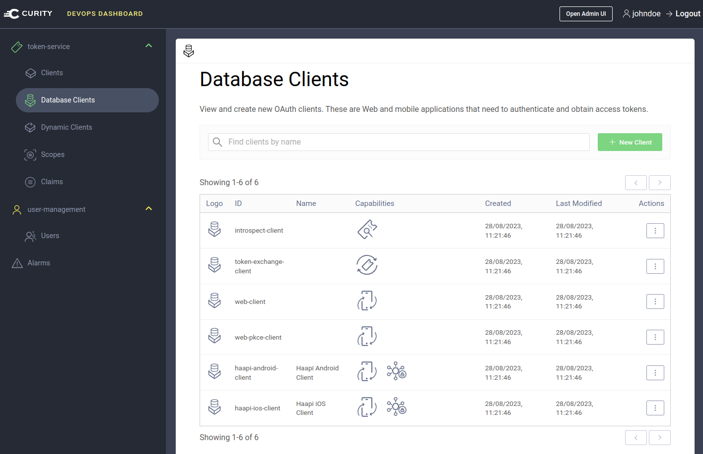

# Database Clients Migration Example

[](https://curity.io/resources/code-examples/status/)
[](https://curity.io/resources/code-examples/status/)

A Node.js console app to show how to migrate OAuth clients from configuration to database storage:

- Read existing clients from all token service profiles using the RESTCONF API
- Translate them to the GraphQL client format
- Save them to a JDBC data source by calling the GraphQL API

## Prerequisites

A working deployment of the Curity Identity Server, with [Database Client Management GraphQL Endpoints](https://curity.io/resources/learn/graphql-client-management/) configured.\
Also ensure that an up to date version of Node.js is installed.

## Reahearse the Migration

To understand the parts involved in a migration, one option is to run the following steps:

### Deploy the Curity Identity Server

Run the [DevOps dashboard example deployment](https://github.com/curityio/devops-dashboard-example) to deploy a system with working GraphQL endpoints.

### Configure a Migration Client

In the Admin UI, apply the [migration-configuration.xml](migration-configuration.xml) file using the `Changes / Upload` option.\
This creates an attribute authorization manager with permissions to call the GraphQL database clients endpoint.

### Ensure Example Clients

In the Admin UI, apply the [example-clients.xml](example-clients.xml) file using the `Changes / Upload` option.

### Run the Migration

Use the following commands to run the migration:

```bash
npm install
npm start
```

This will provide some output messages:

```text
Preparing environment ...
Reading all profiles from configuration ...
Initializing GraphQL client ...
Reading OAuth clients for profile 'token-service' ...
Migrating OAuth client 'haapi-android-client' ...
OAuth client 'haapi-android-client' was succesfully migrated to database storage
Migrating OAuth client 'haapi-ios-dev-client' ...
OAuth client 'haapi-ios-dev-client' was succesfully migrated to database storage
Migrating OAuth client 'introspect-client' ...
OAuth client 'introspect-client' was succesfully migrated to database storage
```

### Remove the Configuration Clients

In the Admin UI, remove the migrated clients from the token service profile.

### View Migrated Clients in the DevOps Dashboard

The updated clients in the DevOps dashboard:



## Run Real Migrations

Once usage is understood, the same approach can be followed for real environments.\
Start with test stages of the deployment pipeline, and do basic testing of your clients after the migration.

### Backup the Configuration

First ensure that you have a working backup of the configuration clients.

### Run the Migration

First, reconfigure the `.env` file to point to your own environment:

```text
RESTCONF_USER='admin'
RESTCONF_PASSWORD='Password1'
ADMIN_BASE_URL='http://localhost:6749'
TOKEN_ENDPOINT='http://localhost:8443/oauth/v2/oauth-token'
GRAPHQL_CLIENT_MANAGEMENT_ENDPOINT='http://localhost:8443/client-management'
MIGRATION_CLIENT_ID='migration-client'
MIGRATION_CLIENT_SECRET='Password1'
MIGRATION_CLIENT_SCOPE='database-clients'
```

This Node.js migration app needs to send access tokens that are authorized to call GraphQL authorization requirements.\

- By default a `migration-client` is used, which uses the client credentials flow to get an access token
- The access token uses a custom `database-clients` scope
- The GraphQL authorization manager enables access tokens with this scope to manage database clients
- This authorization manager is configured against the token service profile

## More information

Please visit [curity.io](https://curity.io/) for more information about the Curity Identity Server.