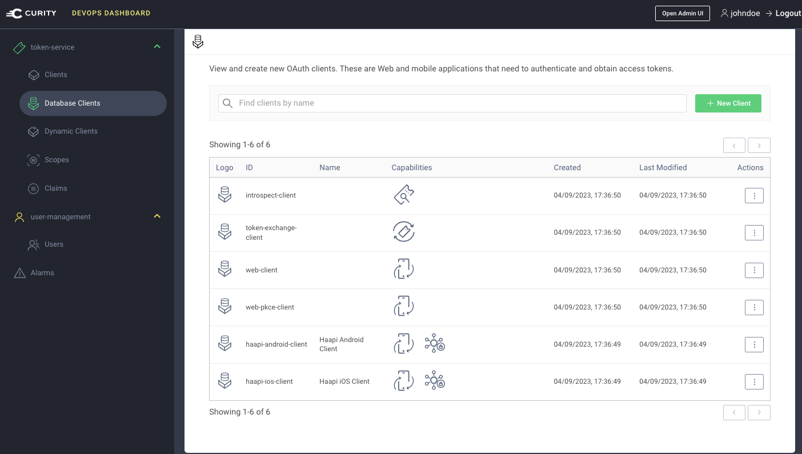

# Database Clients Migration Example

[](https://curity.io/resources/code-examples/status/)
[](https://curity.io/resources/code-examples/status/)

A Node.js console app to show the approach for migrating OAuth clients from configuration to database storage:

- Read existing clients from all token service profiles using the RESTCONF API
- Translate them to the GraphQL client format
- Save them to a JDBC data source by calling the GraphQL API

## Prerequisites

- An instance of the Curity Identity Server with [Database Client Management GraphQL Endpoints](https://curity.io/resources/learn/graphql-client-management/) configured
- Also ensure that the Curity Identity Server is configured to use a JDBC data source
- An up to date version of Node.js is installed

## Rehearse the Migration

You can use the following steps to understand the steps involved in a migration:

### Deploy the Curity Identity Server

Run the [DevOps dashboard example deployment](https://github.com/curityio/devops-dashboard-example) to deploy a system with working GraphQL endpoints.

### Configure a Migration Client

In the Admin UI, apply the [migration-configuration.xml](migration-configuration.xml) file using the `Changes / Upload` option.\
This creates an attribute authorization manager with permissions to call the GraphQL database clients endpoint.\
It also creates a migration client with the correct access tokens configured.

### Ensure Example Clients

In the Admin UI, apply the [example-clients.xml](example-clients.xml) file using the `Changes / Upload` option.

### Run the Migration

Use the following commands to run the migration:

```bash
npm install
npm start
```

This will provide output, including any clients that don't currently support database storage:

```text
Preparing environment ...
Reading all profiles from configuration ...
Initializing GraphQL client ...
Reading OAuth clients for profile 'token-service' ...
Migrating OAuth client 'haapi-android-client' ...
OAuth client 'haapi-android-client' was succesfully migrated to database storage
Migrating OAuth client 'haapi-ios-client' ...
OAuth client 'haapi-ios-client' was succesfully migrated to database storage
Migrating OAuth client 'introspect-client' ...
OAuth client 'introspect-client' was succesfully migrated to database storage
Migrating OAuth client 'token-exchange-client' ...
OAuth client 'token-exchange-client' was succesfully migrated to database storage
Migrating OAuth client 'unsupported-assertion-client' ...
OAuth client 'unsupported-assertion-client' does not yet support database storage
Migrating OAuth client 'web-client' ...
OAuth client 'web-client' was succesfully migrated to database storage
Migrating OAuth client 'web-pkce-client' ...
OAuth client 'web-pkce-client' was succesfully migrated to database storage
```

### Remove Configuration Clients

In the Admin UI, remove the migrated clients from the token service profile.

### View Migrated Clients in the DevOps Dashboard

The migrated clients can now be managed from the DevOps dashboard:



## Run Real Migrations

Once usage is understood, the same approach can be followed for real environments.\
First ensure that you have a working backup of the configuration clients. \
Start with test stages of the deployment pipeline, and do basic testing of your clients after the migration.\
Reconfigure the `.env` file to point the Node.js app to the correct environment before running each migration.\
Also ensure that `NUM_CLIENTS` is not lower than the total number of your configuration clients.

```text
RESTCONF_USER='admin'
RESTCONF_PASSWORD='...'
ADMIN_BASE_URL='https://admin.example-test.com'
TOKEN_ENDPOINT='https://login.example-test.com/oauth/v2/oauth-token'
GRAPHQL_CLIENT_MANAGEMENT_ENDPOINT='https://login.example-test.com/client-management'
MIGRATION_CLIENT_ID='migration-client'
MIGRATION_CLIENT_SECRET='...'
MIGRATION_CLIENT_SCOPE='database-clients'
MIGRATION_TAG='migrated-from-config'
DELETE_MIGRATED_CLIENTS='false'
NUM_CLIENTS:1000
```

## More information

Please visit [curity.io](https://curity.io/) for more information about the Curity Identity Server.
